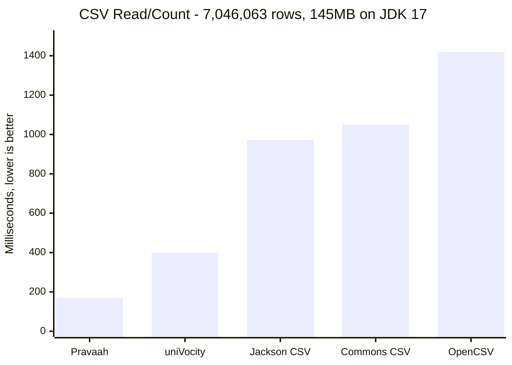
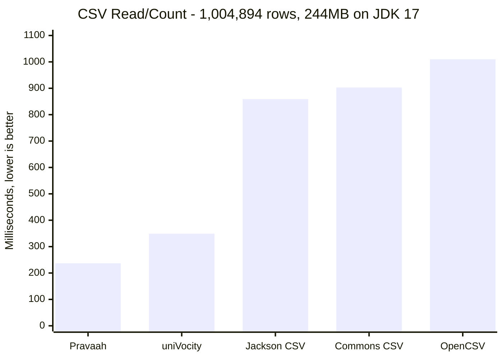
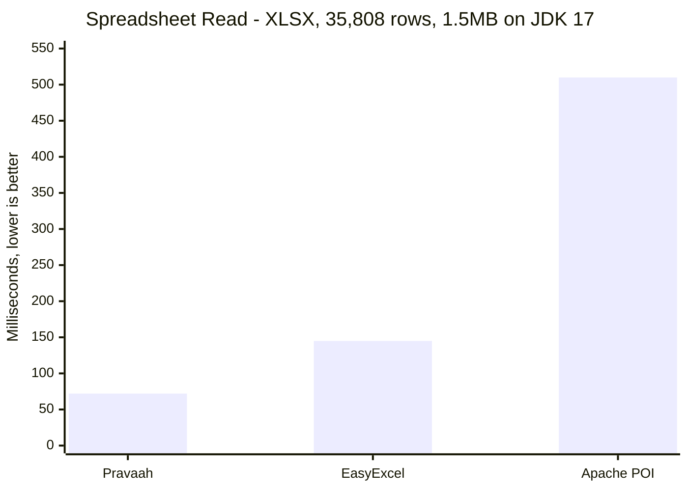
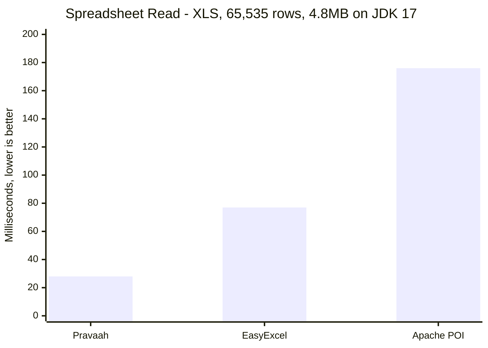
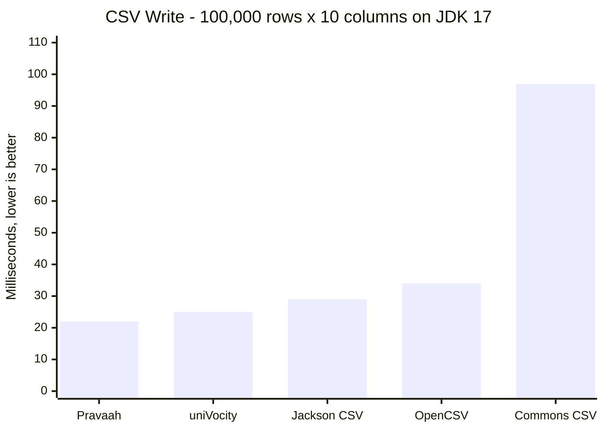
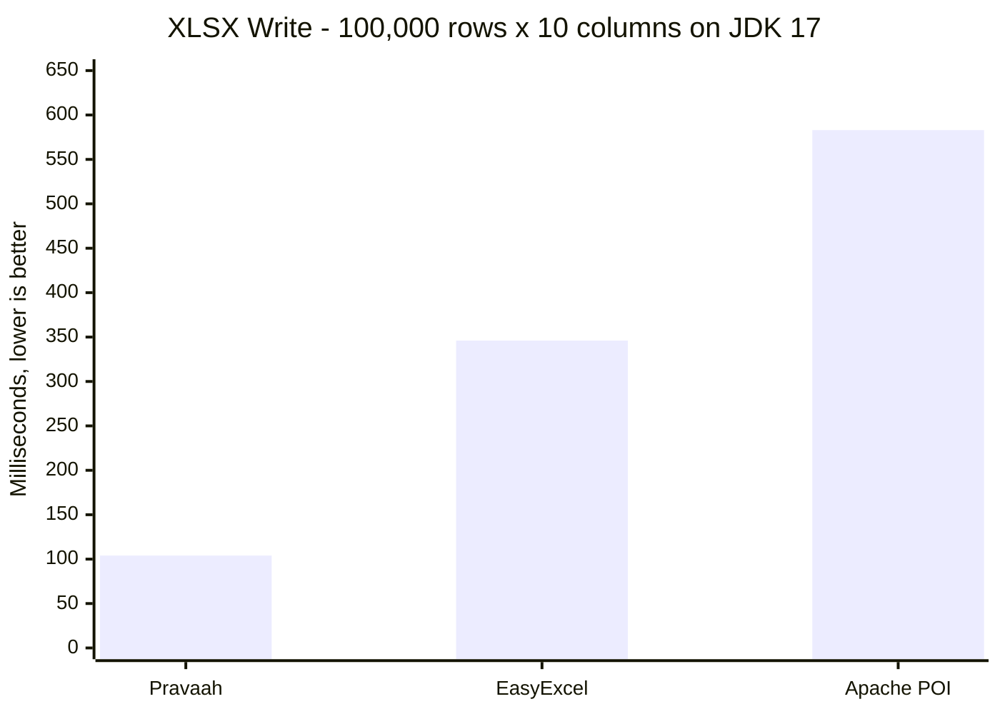

# Pravaah Java

**Stop writing 300 lines of fragile CSV / Excel parsing + validation code.**

Pravaah is the **upload → clean → validate → reject → output** pipeline for Java. Point it at a messy CSV, XLS, XLSX, or JSON file — get back typed rows, a rejection report, and zero hand-written glue.

```text
File ──▶ Clean headers ──▶ Validate schema ──▶ Coerce types ──▶ Output
                                  │
                                  ▼
                          Rejected rows + issues
```

Other libraries solve _one_ slice of this:

| Tool                | What it does            | What it doesn't                                |
| ------------------- | ----------------------- | ---------------------------------------------- |
| Apache POI          | Reads / writes Excel    | No schema, no validation, no rejection report  |
| Apache Commons CSV  | Parses CSV records      | No schema, no header cleanup, no Excel         |
| OpenCSV / uniVocity | Parse / bind CSV        | No XLS / XLSX, no rejection-report pipeline    |
| Jackson CSV         | CSV ↔ POJOs             | No XLS / XLSX, no rejection-report pipeline    |
| **Pravaah**         | **Full ingestion pipeline (CSV + XLS + XLSX + JSON, schema, cleanup, issues)** | — |

- Zero runtime dependencies. Java 8+. Reads legacy `.xls` without Apache POI.
- Schema-first: think Pydantic / Zod / Yup, but for Java file uploads.
- Faster than Apache POI / EasyExcel / Commons CSV / OpenCSV / Jackson CSV on the benchmarks below.

Looking for the Node.js version? See [`beingmartinbmc/pravaah`](https://github.com/beingmartinbmc/pravaah).

```text
CSV direct count: 7,046,063 rows, 145MB
Pravaah Java  170ms on JDK 17

CSV read/count: 1,004,894 rows, 244MB
Pravaah Java  237ms read/count on JDK 17 (warm)
```

Benchmarked locally on the repository benchmark files using JDK 8, 11, and 17 on Apple Silicon.

---

## 30-Second Win

### Input: a real customer upload

```text
"E-mail Address",   " Total ", Active
ada@lovelace.io  ,  1250.00  , yes
not-an-email     ,    50.00  , true
grace@hopper.dev ,   -50.00  , 1
hedy@lamarr.com  ,   980     , no
```

Inconsistent header (`E-mail Address` vs your domain's `email`), padded values, mixed booleans (`yes` / `true` / `1` / `no`), one bad email, one negative total.

### After: Pravaah, in one call

```java
import io.github.beingmartinbmc.pravaah.*;
import io.github.beingmartinbmc.pravaah.schema.*;

SchemaDefinition schema = new SchemaDefinition()
    .field("email",  Schema.email())
    .field("total",  Schema.number())
    .field("active", Schema.bool().defaultValue(false));

CleaningOptions cleaning = CleaningOptions.defaults()
    .trim(true)
    .fuzzyHeader("email", "E-mail Address", "Email Address", "mail");

ProcessResult result = Pravaah.parseDetailed(
    "upload.csv",
    schema,
    ReadOptions.defaults()
        .format(PravaahFormat.CSV)
        .validation(ValidationMode.COLLECT)
        .cleaning(cleaning));

result.getRows();    // 3 typed, validated rows ready to insert
result.getIssues();  // 1 row-numbered rejection: row 2, email, "not-an-email"
```

You get typed rows, fuzzy header matching, value coercion, and a row-numbered rejection report. No `String.split`, no hand-rolled regex, no `try { Double.parseDouble(...) } catch (...)` loops, no parallel rejection list.

Want the rejection report on disk?

```java
SchemaValidator.writeIssueReport(result.getIssues(), "rejected.csv");
```

Want to skip rejected rows entirely instead of collecting them? Swap one enum: `ValidationMode.SKIP`. Want to fail the upload on the first bad row? `ValidationMode.FAIL_FAST`.

---

## Why Pravaah Is Different

Most Java libraries solve _one_ stage of a file upload. Pravaah owns the whole pipeline so you don't glue five things together.

| Stage              | Without Pravaah                                       | With Pravaah                                |
| ------------------ | ----------------------------------------------------- | ------------------------------------------- |
| **Detect format**  | Sniff extension, branch on parser                     | `Pravaah.read(path)` auto-detects           |
| **Parse**          | Different API per format (POI vs Commons CSV vs ...)  | One `Row` model across CSV / XLS / XLSX / JSON |
| **Clean headers**  | Hand-maintained alias `Map<String,String>`            | `cleaning.fuzzyHeader("email", "E-mail", ...)` |
| **Trim / dedupe**  | Bespoke loops                                         | `cleaning.trim(true).dedupeKey("id")`       |
| **Validate types** | `try { parse } catch { add to issues }` per column    | `Schema.email() / number() / bool() / date()` |
| **Reject bad rows**| Parallel `List<Issue>` you maintain by hand           | `result.getIssues()` with row #, column, expected, raw value |
| **Report**         | Roll your own CSV writer for the rejection report     | `SchemaValidator.writeIssueReport(...)`     |
| **Stream big files** | Custom counters, hand-tuned buffers                 | `CsvReader.drainCount(...)` count-only sink |

**Other things you get for free:**

- No Apache POI dependency, even for legacy `.xls`.
- Lazy `PravaahPipeline` so `map / filter / clean / schema / take / write` fuses into one pass.
- Java 8 compatible with Java 11 / 17 overlays loaded automatically from the same MR-JAR.
- Works in legacy enterprise environments — no dependency hell, no transitive surprises.

---

## How It Works

```text
┌──────────────┐    ┌─────────┐    ┌──────────┐    ┌───────────┐    ┌──────────┐
│     File     │───▶│  Clean  │───▶│ Validate │───▶│ Transform │───▶│  Output  │
│ CSV/XLS/XLSX │    │ headers │    │  schema  │    │  map/filt │    │ file/db  │
│     JSON     │    │ values  │    │          │    │           │    │ reports  │
└──────────────┘    └─────────┘    └──────────┘    └───────────┘    └──────────┘
                          │               │                │
                          ▼               ▼                ▼
                    fuzzy match     type-safe rows    fused stages
                    trim/dedupe     issue report      one pass
```

A rejected upload looks like this on disk (`SchemaValidator.writeIssueReport(issues, "rejected.csv")`):

```text
severity,code,message,rowNumber,column,expected,rawValue
error,invalid_type,email must be email,14,email,email,not-an-email
error,invalid_value,total cannot be negative,203,total,number,-50.00
```

Under the hood: CSV uses a direct scanner that can emit to a count-only sink, a row materializer, or a validation sink. XLSX uses selective ZIP / XML parsing. XLS uses an internal OLE2 + BIFF8 reader, so legacy Excel reads do not require Apache POI.

---

## Install

Requires Java 8+. Build uses a multi-release JAR so newer JVMs automatically load newer runtime internals.

Maven Central: [`io.github.beingmartinbmc:pravaah-java`](https://central.sonatype.com/artifact/io.github.beingmartinbmc/pravaah-java)

```xml
<dependency>
    <groupId>io.github.beingmartinbmc</groupId>
    <artifactId>pravaah-java</artifactId>
    <version>1.1.0</version>
</dependency>
```

---

## Use Pravaah If…

- You expose a "**Upload your CSV / Excel**" feature and you're tired of re-implementing the same parse → validate → reject loop on every project.
- You build SaaS / internal tools that ingest customer or vendor spreadsheets and need explainable rejection reports.
- You run batch jobs / ETL steps that must keep good rows and surface the bad ones.
- You want CSV / XLS / XLSX ingestion that drops into a Java 8 enterprise stack with **zero runtime dependencies**.

## Don't Use Pravaah If…

- You need Excel styling, charts, macros, pivot tables, or workbook editing fidelity → use **Apache POI**.
- You need to ingest terabytes across a cluster → use **Spark** or **Flink**.
- You read one tiny CSV with no validation, ever → plain Java is fine.

---

## Quick Start

### Read Any Supported File

```java
List<Row> rows = Pravaah.read("customers.xls").collect();
```

Auto-detects `.csv`, `.xls`, `.xlsx`, and `.json` from file paths. For byte arrays, pass the format:

```java
List<Row> rows = Pravaah.read(bytes, ReadOptions.defaults().format(PravaahFormat.XLS)).collect();
```

### Read A Sheet

```java
List<Row> finance = Pravaah.read("report.xlsx",
    ReadOptions.defaults().sheetName("Finance")).collect();

List<Row> second = Pravaah.read("legacy.xls",
    ReadOptions.defaults().sheetIndex(1)).collect();
```

### Transform And Write

```java
ProcessStats stats = Pravaah.read("orders.csv")
    .schema(new SchemaDefinition()
        .field("orderId", Schema.string())
        .field("email", Schema.email())
        .field("total", Schema.number()))
    .filter(row -> ((Number) row.get("total")).doubleValue() > 100)
    .write("priority-orders.xlsx", WriteOptions.defaults().format(PravaahFormat.XLSX));

System.out.println("Wrote " + stats.getRowsWritten() + " rows");
```

### Count CSV Rows Without Row Materialization

```java
int rows = CsvReader.drainCount("large.csv", ReadOptions.defaults());
```

This uses the direct CSV scanner count sink. `Pravaah.read(...).collect()` materializes rows when you need row objects.

---

## Core Focus

- CSV parser with quoted fields, escaped quotes, embedded newlines, CRLF, custom delimiters, and direct count scans.
- XLS read support through an internal OLE2/BIFF8 parser.
- XLSX read/write support through ZIP/XML parsing and writer utilities.
- JSON read/write for fixtures and pipeline output.
- Schema validation for string, number, boolean, date, email, phone, and any values.
- Cleaning with trim, whitespace normalization, fuzzy header aliases, and deduplication.
- Issue reports with row numbers, column names, expected types, and raw values.
- Lazy pipeline API with map, filter, clean, schema, take, collect, drain, process, and write.

## Advanced Features

- Formula engine, SQL-like queries, dataset diffing, joins, and plugin extension points.

---

## File Format Support

| Format | Read | Write | Notes |
| --- | :---: | :---: | --- |
| `.csv` | Yes | Yes | Direct scanner, custom delimiters, quoted records, count-only path |
| `.xls` | Yes | No | Zero-dependency OLE2/BIFF8 reader for legacy Excel workbooks |
| `.xlsx` | Yes | Yes | Selective ZIP/XML reader plus multi-sheet writer |
| `.json` | Yes | Yes | Useful for tests, snapshots, and intermediate ETL |

---

## Pipeline API

`Pravaah.read(...)` returns a lazy `PravaahPipeline`. Work runs when you call a terminal operation.

| Method | Purpose |
| --- | --- |
| `.map(fn)` | Transform each row |
| `.filter(fn)` | Keep matching rows |
| `.clean(options)` | Trim, normalize whitespace, fuzzy-match headers, dedupe |
| `.schema(definition)` | Validate and coerce rows |
| `.take(n)` | Limit output |
| `.collect()` | Return rows |
| `.drain()` | Execute and return stats |
| `.process()` | Return rows, issues, and stats |
| `.write(dest, options)` | Write CSV, XLSX, or JSON |

---

## Schema Validation

```java
SchemaDefinition schema = new SchemaDefinition()
    .field("id", Schema.string())
    .field("email", Schema.email())
    .field("age", Schema.number(true))
    .field("active", Schema.bool().defaultValue(true))
    .field("signupDate", Schema.date());
```

Validation modes:

| Mode | Behavior |
| --- | --- |
| `FAIL_FAST` | Throw on the first invalid row |
| `COLLECT` | Keep valid rows and collect issues |
| `SKIP` | Drop invalid rows without collecting issues |

Field options include `optional`, `defaultValue`, `coerce`, and custom validators.

---

## Workbook Authoring

```java
Worksheet summary = new Worksheet("Summary",
    Arrays.asList(
        Row.of("metric", "Revenue", "value", 125000),
        Row.of("metric", "Target", "value", 100000),
        Row.of("metric", "Delta", "value", new FormulaCell("B2-B3", 25000))
    ));

summary.setFrozen(new FreezePane(0, 1, "A2"));
XlsxWriter.writeWorkbook(new Workbook(Collections.singletonList(summary)), "report.xlsx");
```

XLSX writing supports multiple sheets, formulas, frozen panes, column metadata, tables, and data validation helpers. Legacy `.xls` is read-only.

---

## Query, Diff, Join

```java
List<Row> top = Pravaah.query(rows,
    "SELECT id, name, revenue WHERE revenue >= 100000 ORDER BY revenue DESC LIMIT 25");

DiffResult changes = Pravaah.diff(beforeRows, afterRows, "customerId");

List<Row> enriched = Pravaah.joinRows(orders, customers, "customerId");
```

---

## Benchmarks

Every number below was measured locally with the current Java implementation on Apple Silicon with `-Xmx6g`. Each workload was warmed up once, then measured twice; the table reports the best observed time. Row counts are data rows, excluding the header row where applicable.

### Benchmark Notes

- Same dataset used across all libraries for each workload.
- JVM warmed before measurement.
- Best observed run reported after warmup.
- CSV competitors use their standard header-aware parsing APIs.
- XLS/XLSX competitors use Apache POI `WorkbookFactory` and EasyExcel sheet readers.
- Output was verified against competitors by row count and normalized row-value hashes.

### CSV Read/Count

CSV workloads are benchmarked against CSV competitors: uniVocity, Apache Commons CSV, OpenCSV, and Jackson CSV. Pravaah uses the direct count path, `CsvReader.drainCount(...)`, which parses CSV records without materializing `Row` objects.





#### JDK 8

| Format | File size | Rows | Pravaah | uniVocity | Commons CSV | OpenCSV | Jackson CSV |
| --- | ---: | ---: | ---: | ---: | ---: | ---: | ---: |
| CSV | 498 KB | 1,000 | 1 ms | 1 ms | 2 ms | 5 ms | 3 ms |
| CSV | 244 MB | 1,004,894 | 277 ms | 314 ms | 862 ms | 787 ms | 726 ms |
| CSV | 145 MB | 7,046,063 | 182 ms | 391 ms | 810 ms | 803 ms | 826 ms |

#### JDK 11

| Format | File size | Rows | Pravaah | uniVocity | Commons CSV | OpenCSV | Jackson CSV |
| --- | ---: | ---: | ---: | ---: | ---: | ---: | ---: |
| CSV | 498 KB | 1,000 | 3 ms | 3 ms | 2 ms | 8 ms | 3 ms |
| CSV | 244 MB | 1,004,894 | 394 ms | 420 ms | 919 ms | 899 ms | 952 ms |
| CSV | 145 MB | 7,046,063 | 188 ms | 385 ms | 1.15 s | 1.27 s | 1.24 s |

#### JDK 17

| Format | File size | Rows | Pravaah | uniVocity | Commons CSV | OpenCSV | Jackson CSV |
| --- | ---: | ---: | ---: | ---: | ---: | ---: | ---: |
| CSV | 498 KB | 1,000 | 1 ms | 3 ms | 3 ms | 6 ms | 3 ms |
| CSV | 244 MB | 1,004,894 | 237 ms | 349 ms | 903 ms | 1.01 s | 859 ms |
| CSV | 145 MB | 7,046,063 | 170 ms | 400 ms | 1.05 s | 1.42 s | 972 ms |

### Spreadsheet Read

Spreadsheet workloads are benchmarked against corresponding spreadsheet competitors: Apache POI and EasyExcel. Pravaah materializes rows through the XLS/XLSX readers.





#### JDK 8

| Format | File size | Rows | Pravaah | Apache POI | EasyExcel |
| --- | ---: | ---: | ---: | ---: | ---: |
| XLSX | 244 KB | 1,000 | 13 ms | 50 ms | 18 ms |
| XLSX | 1.5 MB | 35,808 | 71 ms | 412 ms | 133 ms |
| XLS | 4.8 MB | 65,535 | 28 ms | 154 ms | 66 ms |

#### JDK 11

| Format | File size | Rows | Pravaah | Apache POI | EasyExcel |
| --- | ---: | ---: | ---: | ---: | ---: |
| XLSX | 244 KB | 1,000 | 18 ms | 84 ms | 23 ms |
| XLSX | 1.5 MB | 35,808 | 71 ms | 551 ms | 145 ms |
| XLS | 4.8 MB | 65,535 | 27 ms | 219 ms | 91 ms |

#### JDK 17

| Format | File size | Rows | Pravaah | Apache POI | EasyExcel |
| --- | ---: | ---: | ---: | ---: | ---: |
| XLSX | 244 KB | 1,000 | 19 ms | 69 ms | 21 ms |
| XLSX | 1.5 MB | 35,808 | 72 ms | 510 ms | 145 ms |
| XLS | 4.8 MB | 65,535 | 28 ms | 176 ms | 77 ms |

### Write

Write workloads use 100,000 generated rows x 10 columns. CSV is compared with CSV writer libraries; XLSX is compared with Apache POI streaming SXSSF and EasyExcel. Pravaah favors write throughput for XLSX ZIP compression, so the XLSX output is larger than EasyExcel's but writes faster in this workload. Legacy `.xls` is read-only in Pravaah, so there is no `.xls` write benchmark.





#### JDK 8

| Format | Rows x columns | Output size | Pravaah | uniVocity | Commons CSV | OpenCSV | Jackson CSV | Apache POI | EasyExcel |
| --- | ---: | ---: | ---: | ---: | ---: | ---: | ---: | ---: | ---: |
| CSV | 100,000 x 10 | 11.3 MB | 24 ms | 33 ms | 109 ms | 37 ms | 31 ms | - | - |
| XLSX | 100,000 x 10 | 5.2 MB | 131 ms | - | - | - | - | 680 ms | 326 ms |

#### JDK 11

| Format | Rows x columns | Output size | Pravaah | uniVocity | Commons CSV | OpenCSV | Jackson CSV | Apache POI | EasyExcel |
| --- | ---: | ---: | ---: | ---: | ---: | ---: | ---: | ---: | ---: |
| CSV | 100,000 x 10 | 11.3 MB | 25 ms | 29 ms | 64 ms | 37 ms | 31 ms | - | - |
| XLSX | 100,000 x 10 | 5.2 MB | 129 ms | - | - | - | - | 663 ms | 323 ms |

#### JDK 17

| Format | Rows x columns | Output size | Pravaah | uniVocity | Commons CSV | OpenCSV | Jackson CSV | Apache POI | EasyExcel |
| --- | ---: | ---: | ---: | ---: | ---: | ---: | ---: | ---: | ---: |
| CSV | 100,000 x 10 | 11.3 MB | 22 ms | 25 ms | 97 ms | 34 ms | 29 ms | - | - |
| XLSX | 100,000 x 10 | 5.2 MB | 104 ms | - | - | - | - | 583 ms | 346 ms |

### Format Coverage

The test suite verifies the same logical ingestion rows across CSV, XLS, and XLSX, including strings, numbers, booleans, blank cells, formulas with cached values, sheet selection, headerless reads, explicit headers, validation, and corrupt workbook handling.

Run your own benchmarks with the public API:

```java
long start = System.nanoTime();
List<Row> rows = Pravaah.read("large.csv").collect();
long ms = (System.nanoTime() - start) / 1_000_000;
System.out.println(rows.size() + " rows in " + ms + "ms");
```

No benchmark harness or downloaded competitor jars are required in the repository.

---

## How The Performance Works

**CSV read:** A single inline scanner walks the text once with no per-field allocations. Sinks receive field slices (start, end) instead of substrings, so the count path skips `String` materialization entirely. The row materializer reuses the same key lookup per column for the whole pass.

**CSV write:** Writes directly into a 64 KiB byte buffer with an ASCII fast path that bypasses `OutputStreamWriter` per-char encoding. UTF-8 is only invoked when a value contains non-ASCII characters.

**XLS:** The reader opens the OLE2 compound file, extracts the `Workbook` stream, and parses BIFF8 records directly. It handles shared strings, sheet metadata, numeric cells, RK cells, booleans, blanks, labels, and cached formula values.

**XLSX read:** Targets workbook metadata and selected worksheet XML instead of building a full workbook object model. Worksheet XML is scanned in place by character index, so cell values become `Row` entries without intermediate `Object[]` arrays. XML entity decoding runs as a single-pass `StringBuilder` walk; the regex fallbacks were retired.

**XLSX write:** Cell column-name prefixes are pre-encoded as ASCII byte arrays once per sheet. Row XML is emitted through a 64 KiB byte sink with an ASCII fast path; XML escaping happens in a single pass without intermediate strings.

**MR-JAR:** Java 8 uses the baseline runtime classes. Java 11 and Java 17+ load overlay implementations from `META-INF/versions/*`.

---

## API Reference

| API | Purpose |
| --- | --- |
| `Pravaah.read(source, options)` | Create a pipeline from CSV, XLS, XLSX, JSON, bytes, or rows |
| `Pravaah.write(rows, dest, options)` | Write CSV, XLSX, or JSON |
| `Pravaah.parse(source, schema, options)` | Validate and return typed rows |
| `Pravaah.parseDetailed(source, schema, options)` | Return rows, issues, and stats |
| `CsvReader.drainCount(source, options)` | Count CSV rows without materializing rows |
| `SchemaValidator.writeIssueReport(issues, dest)` | Write validation diagnostics as CSV |
| `Pravaah.query(rows, sql)` | SQL-like queries over rows |
| `Pravaah.diff(before, after, key)` | Dataset diffs by key |
| `Pravaah.joinRows(left, right, key)` | Join two row sets |
| `XlsxWriter.writeWorkbook(workbook, dest)` | Multi-sheet XLSX authoring |

### Read Options

| Option | Description |
| --- | --- |
| `format` | Force `CSV`, `XLS`, `XLSX`, or `JSON` |
| `sheetName` | Select a worksheet by name |
| `sheetIndex` | Select a worksheet by zero-based index |
| `headers` | Use first row as headers, or read headerless rows |
| `headerNames` | Supply explicit headers |
| `delimiter` | CSV delimiter, one character |
| `inferTypes` | Convert CSV strings to numbers, booleans, and nulls |
| `formulas` | Preserve formula metadata where supported |
| `validation` | `FAIL_FAST`, `COLLECT`, or `SKIP` |
| `cleaning` | Trim, normalize whitespace, fuzzy headers, dedupe |

---

## Development

```sh
mvn test
mvn package -DskipTests
```

The normal test suite has no competitor-library dependency.

---

## License

[MIT](LICENSE)
